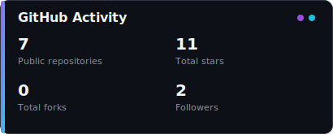
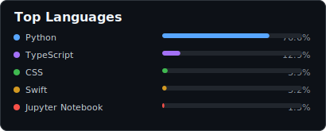

  

 

## 👋 About Me

*Ph.D. student · Computational biology researcher · AI developer*

I am a Ph.D. student in **Computer Science and Technology at Yunnan University**, supervised by **Professor Wenwen Min (闵文文)**. My work sits at the intersection of artificial intelligence, spatial omics, and medical imaging—turning complex biological data into useful computational insight.

- 🧬 Exploring **spatial transcriptomics** and cross-modal analysis
- 🧠 Building methods for **few-shot incremental learning**
- 🩻 Applying AI to **medical image processing**
- 📝 Published at **AAAI, ACM TOMM, and ICASSP**
- 🔎 Reviewer for **ICME, ICASSP, and AIES-SP**
- 🌱 Always learning, collaborating, and contributing to meaningful research

 

---

## 🔬 Research Focus

| Spatial Transcriptomics | Cross-modal Learning | Medical AI |
|:---:|:---:|:---:|
| Mapping tissue organization from spatially resolved molecular data | Connecting complementary biological and visual modalities | Designing data-efficient models for medical image understanding |

## 🧰 Research & Development Stack

## 📊 GitHub Activity

  
  

 

  Open to research discussions, interdisciplinary collaboration, and ideas that connect AI with biomedicine.

